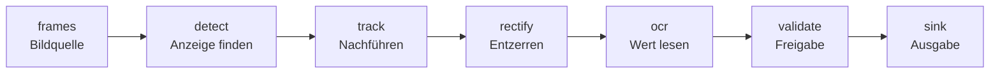

# API-Referenz

Erzeugt beim Bauen der Seite direkt aus den Docstrings in `src/dispread`, ohne KI.
Was hier steht, steht so im Code. Die Reihenfolge folgt der Verarbeitungskette
aus Konzept.md §3:

| Seite | Inhalt |
| --- | --- |
| [Verträge und Datensätze](vertraege.md) | `ValueRecord`, Zeitstempel, Raster, Sitzungsprofil |
| [Bildquellen](frames.md) | `synthetic://`, `replay://` und die Quellen-Registry |
| [Anzeige finden](detect.md) | manuelle ROI |
| [Nachführen und Entzerren](geometrie.md) | `QuadTracker`, Vierpunkt-Entzerrung, Glas-Quad |
| [Wert lesen](ocr.md) | Sieben-Segment, tesseract, Autofit |
| [Freigabe](validate.md) | Freigaberegeln |
| [Ausgabe](sink.md) | JSONL, seriell, Telegrammformate |
| [Pipeline](pipeline.md) | Verdrahtung und `PipelineTrace` |
| [Workbench](workbench.md) | Bedienoberfläche |
