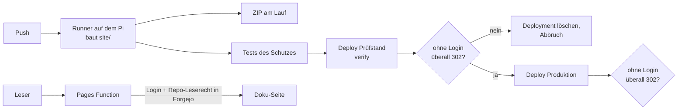

# Doku-Hosting: Cloudflare Pages mit Forgejo-Anmeldung

Die Doku-Seite baut der Forgejo-Runner auf dem Pi (`.github/workflows/docs.yml`).
Das Offline-ZIP `doku-seite` hängt immer am Lauf. Zusätzlich liegt die Seite
unter **https://picam-docs.pages.dev**. Lesen darf sie nur, wer sich über
Forgejo anmeldet **und das Repo `l.hentschke/picam-ai` lesen darf**.

## Wie der Schutz funktioniert

`cloudflare/functions/_middleware.js` ist eine **Pages Function**. Sie steckt
in jedem Deployment und läuft vor **jeder** Anfrage, auch vor statischen
Dateien und dem Suchindex.

1. Ohne gültige Sitzung leitet sie zur Forgejo-Anmeldung weiter
   (OAuth2 mit PKCE und signiertem `state`).
2. Nach der Rückkehr tauscht sie den Code gegen einen Token und fragt damit
   `GET /api/v1/repos/l.hentschke/picam-ai` ab. Nur bei `permissions.pull == true`
   gibt es eine Sitzung. Den Token verwirft sie danach.
3. Die Sitzung ist ein HMAC-signiertes Cookie (`__Host-`, `Secure`, `HttpOnly`)
   mit 8 h Laufzeit. Wem in Forgejo das Leserecht entzogen wird, verliert den
   Zugang also spätestens nach 8 h.
4. Im Zweifel lehnt sie ab: Fehlt Konfiguration, kommt 500; ist Forgejo nicht
   erreichbar, kommt 502; ist das Cookie ungültig, geht es zurück zur Anmeldung.

Tests: `node --test cloudflare/test/`. Sie decken ab:

* Ablehnung ohne, mit abgelaufener, manipulierter und fremd signierter Sitzung
* fehlende und schwache Konfiguration
* falschen `state` und fehlendes Leserecht
* offene Weiterleitungen
* den erfolgreichen Durchlauf

Warum kein Cloudflare Access: Zero Trust verlangt eine hinterlegte Kreditkarte,
auch im kostenlosen Plan. Die Pages Function ist im kostenlosen
Workers-Kontingent enthalten (100 000 Anfragen pro Tag) und prüft sogar genauer,
nämlich die Repo-Rechte statt einer E-Mail-Regel. Die abgewogenen Alternativen
stehen in [project_history.md](project_history.md), Eintrag vom 2026-09-23.

## Was eingerichtet ist (2026-09-23)

| Wo | Was |
| --- | --- |
| Cloudflare, Pages-Projekt `picam-docs` | Production branch `master`. Variablen: `OAUTH_CLIENT_ID`; als Secret: `OAUTH_CLIENT_SECRET`, `SESSION_SECRET` |
| Cloudflare, API-Token „picam-docs deploy“ | nur *Pages Write* für dieses Konto, läuft am 2027-09-23 ab |
| Forgejo, OAuth2-Anwendung „Doku-Seite picam-docs“ | vertraulicher Client, Weiterleitung nur `https://picam-docs.pages.dev/_auth/callback` |
| Forgejo, Repo → Einstellungen → Actions | Secret `CLOUDFLARE_API_TOKEN` (Deploy-Token), Variablen `CLOUDFLARE_ACCOUNT_ID`, `CLOUDFLARE_PAGES_PROJECT` |

Vorschau-Adressen (`verify.picam-docs.pages.dev`, `<hash>.picam-docs.pages.dev`)
sind ebenfalls geschützt. Anmelden kann man sich dort aber nicht, denn in
Forgejo ist nur die Produktivadresse als Weiterleitung eingetragen. Der
Prüfstand dient nur der automatischen Schutzprüfung.

## Wartung

* **Deploy-Token erneuern** (jährlich): neuen Token mit nur *Pages Write*
  anlegen und das Forgejo-Secret `CLOUDFLARE_API_TOKEN` ersetzen.
* **Alle Sitzungen beenden:** `SESSION_SECRET` im Pages-Projekt durch einen
  neuen Zufallswert (≥ 32 Zeichen) ersetzen und neu deployen.
* **Client-Secret erneuern:** in Forgejo bei der OAuth2-Anwendung neu erzeugen,
  dann `OAUTH_CLIENT_SECRET` im Pages-Projekt setzen und neu deployen.
* **Schutz von Hand prüfen:**
  `./scripts/check-auth-protected.sh https://picam-docs.pages.dev`
* **Abschalten:** die Variable `CLOUDFLARE_PAGES_PROJECT` in Forgejo löschen,
  dann gibt es keine Uploads mehr. Um alles zu entfernen, das Pages-Projekt löschen.

## Grenzen

* **Die Doku liegt bei Cloudflare**, einschließlich Laborjournal und Quelltext
  in der API-Referenz. Der Schutz hält Fremde fern, nicht den Anbieter.
* **Eigener Anmelde-Code:** Die Function ist kein geprüftes Fertigprodukt.
  Änderungen an ihr nur mit Tests, und nach jedem Deploy muss die
  Schutzprüfung grün sein.
* **Wer eingeloggt ist, sieht alles.** Es gibt keine Abstufung innerhalb der Doku.
